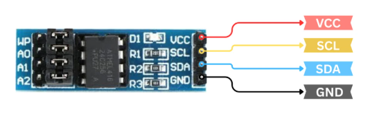

AT24C256 EEPROM 
********
Zephyr RTOS library for AT24C256 EEPROM

overview of EEPROM
********************

if you want store your data in your zephyr project ``AT24C256 EEPROM`` is best choice. in this project,
I was added the tutorial and zephyr driver. we will interface AT24C256 with Zephyr using I2C communication.
you will learn how write, read and erase the data in the EEPROM. specially how to write 1-Byte, 2-Byte and 
multiple byte in the order.

in additon. we will see the specification of AT24C256 EEPROM.

Prerequisites
=============

Table of Contents
=================

- `Building and Running`_
- `Write Function`_
- `Read Function`_
- `Sample Output`_

Write Function
==============

.. code-block:: c

	printf("Hello from readme fiile");

Read Function
==============

.. code-block:: c

	printf("Hello from readme fiile");

Sample Output
=============

.. code-block:: console

    Hello! I\'m your echo bot.
    Tell me something and press enter:
    # Type e.g. "Hi there!" and hit enter!
    Echo: Hi there!

.. code-block:: c

	printf("Hello from readme fiile")

