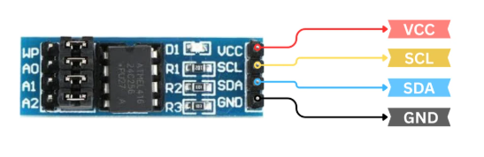

Project Discription
*******************
Zephyr RTOS library for AT24C256 EEPROM

overview of AT24C256 EEPROM 
********************

if you want store your data in your zephyr project ``AT24C256 EEPROM`` is best choice. in this project,
I was added the tutorial and zephyr driver. we will interface AT24C256 with Zephyr using I2C communication.
you will learn how write, read and erase the data in the EEPROM. specially how to write 1-Byte, 2-Byte and 
multiple byte in the order.

in additon. we will see the specification of AT24C256 EEPROM.

Specifiactions
==============
- 2-Wire Serial interface.
- self-timed write cycle (5ms Max)
- High reliability
    - Endurance         : 1,000,000 write cycles
    - Data retention    : 40 years
- Organized as 32,768 words of 8 bits.
- Write protection (Hardware pin)
- Low-voltage and standard voltage operation
    - Vcc : 1.7V to 5.5V
- 400kHz (1.7V) and 1Mhz (2.5V, 2.7V, 5V) compatibility.

Applications
============
- Automative ECU and Applications
- indrustrial IoT Gateways
- Data loggers

Pin Confiurations
=================
=====     =====================
Pin         Function
=====     =====================
A0          Address Input
A1          Address Input
A2          Address Input
GND         Ground
SDA         Serial data
SCL         Serial clock Input
WP          Write protection
Vcc         Power supply
=====     =====================

Memory Organization
===================
- Size of AT24C256 : 256K
- Pages : 512 Pages of 64-bytes each
- Word Address : 15-bit

+------------+--------------+-----------+-------------+
| Block No   | Start Addr   | End Addr  | Description |
+============+==============+===========+=============+
| 0          | 0x0000       | 0x003F    | Page 0      | 
+------------+--------------+-----------+-------------+
| 1          | 0x0040       | 0x007F    | Page 1      |
+------------+--------------+-----------+-------------+
| 2          | 0x0080       | 0x00BF    | Page 2      |
+------------+--------------+-----------+-------------+
| ...        | ...          | ...       | ...         |
+------------+--------------+-----------+-------------+
| 510        | 0x7F80       | 0x7FBF    | Page 510    |
+------------+--------------+-----------+-------------+
| 511        | 0x7FC0       | 0x7FFF    | Page 511    |
+------------+--------------+-----------+-------------+

Prerequisites
=============

- Konwledge in Zephyr RTOS
- C or C++
- I2C interface

Table of Contents
=================

- `Prerequisites`_
- `Write Function`_
- `Read Function`_
- `Sample Output`_

EEPROM Initialization
=====================
Initialize the EEPROM Driver and I2C interface

Init Function
-------------
.. code-block:: c 
    /**
    * @breif eepromInit is initialise the device driver and I2c driver
    * @param i2c_dt_spec *dev pass the pointer to init the driver
    * @returns none
    */

    void eepromInit(at24_eeprom_t *config, const struct i2c_dt_spec *dev)

Write Function
==============

.. code-block:: c

	printf("Hello from readme fiile");

Read Function
==============

.. code-block:: c

	printf("Hello from readme fiile");

Sample Output
=============

.. code-block:: console

    Hello! I\'m your echo bot.
    Tell me something and press enter:
    # Type e.g. "Hi there!" and hit enter!
    Echo: Hi there!

.. code-block:: c

	printf("Hello from readme fiile")

